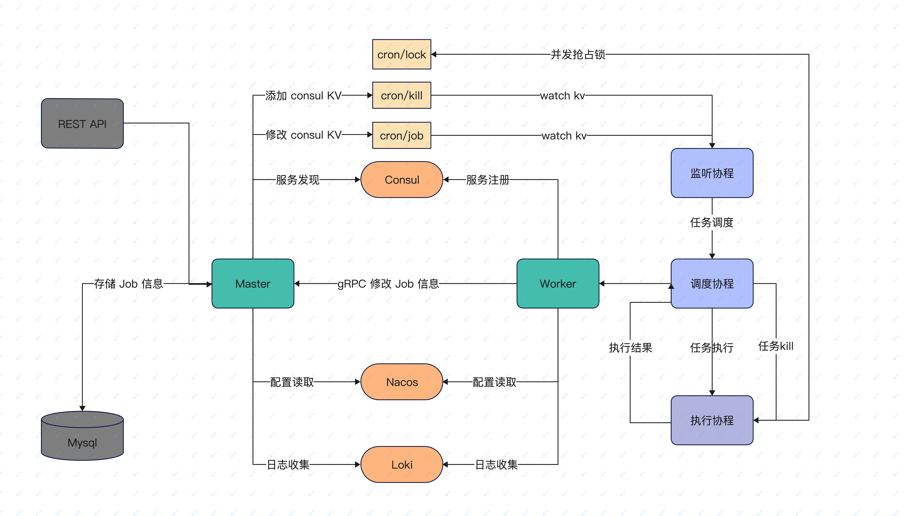

# Crontab 分布式调度项目

# 目录结构

```text
├── app
│   ├── master
│   │   ├── api                  // api 和 gRPC 接口
│   │   ├── code                 // api 返回错误码定义
│   │   ├── common               // 通用变量定义
│   │   ├── config                // 配置文件
│   │   ├── initialize           // 项目初始化定义
│   │   ├── middleware           // 中间件
│   │   ├── pkg                  // 核心工具包
│   │   │   └── core
│   │   ├── repository           // gorm-Gen 生成
│   │   │   └── dal
│   │   │       ├── model
│   │   │       └── query
│   │   ├── router               // 路由拆分
│   │   └── services             // 服务层
│   └── worker
│       ├── common               // 通用变量定义
│       ├── config                // 配置文件
│       ├── initialize           // 项目初始化
│       └── manager              // 管理器开发
├── cmd
│   └── generate     // 自动生成 Mysql Model 脚本
├── proto            // proto 协议文件
├── test             
│   └── api          // 测试 API 的 curl
└── util
    ├── db           // database 操作
    ├── json
    ├── register     // 注册服务
    └── validation   // validator 工具
```

# 项目介绍

分布式 crontab 调度项目

* `master` 负责任务创建，页面接口对接
* `worker` 负责任务的调度，以及任务的执行，`Worker` 可横向扩展部署。
* `jobs` 一些需要被调度的任务执行逻辑



## master

1. `Gin` 提供 `Job` 的增删改查 `API` 接口。
2. `consul` 发现 `worker` 服务节点是否可用。
3. 通过 `consul` 操作 `cron/jobs/` 前缀 `key`，通过 `worker` 节点进行 `watch` 任务的变动。
4. 通过 `consul` 操作 `cron/killer/` 通知 `worker` 节点停止任务。
5. `gRPC` 提供 `Worker` 节点修改 `Job` 数据库的 `API` 接口。

## worker

1. 将服务注册到 `consul` 负责服务发现功能；
2. 使用 `consul` 的 `KV` 将每个任务的配置信息进行保存；
3. 利用 `consul` 的 `watch` 机制对某个目录下所有的 `key` 进行监控；
4. 监听前缀目录`cron/jobs/`所有任务的状态，将任务放入到 `scheduler` 中进行调度；
5. 使用 `consul` 中 `Session` 配合 `Lock` 实现分布式锁，防止任务并发执行；
   1. 首先申请一个 `Session`，设置 `TTL` 时间为 `20s`。
   2. 基于该 `Session` 对 `KV` 调用 `Acquire` 进行锁的获取。
   3. 若其中一个节点获取到了锁，则进行该任务的执行。
   4. 启动一个 `goroutine` 对该 `Session` 进行 `Renew` 操作，每隔 `20s` 进行一次 `Renew` 操作。
   5. 当任务执行完成后，对该 `Session` 的 `KV` 调用 `Release` 方法释放锁（也可等 `TTL` 到期自动删除）。
   6. 停止掉 `goroutine` 对 `Session` 的 `Renew` 操作。
6. `worker` 进行任务 `kill` 操作，通过 `context` 取消掉本次执行的任务。
7. `worker` 执行 `Job` 完成后通过 `gRPC` 修改数据库中 `Job` 任务的状态，以及任务执行日志。

确保所有节点都有机会执行任务，引入随机睡眠 `0~1s`。

# 基于GIN的一些封装

1. `pkg.core.context` 使用 `sync.Pool` 对 `*gin.Context` 做了封装，使得 `*gin.Context` 可以被复用。
2. `pkg.core.core` 将 `gin Router` 和 `gRPC` 注册服务封装到 `Mux` 对象中。
3. `gRPC` 链接的负载均衡，负责持久链接并且自动切换可用服务。

## 常用包

1. `gin`
2. `viper`
3. `gorm`
4. `validator`()
5. [Gorm-Gen](https://github.com/go-gorm/gen/blob/master/README.ZH_CN.md) `Gorm` 官方提供的 `Model` 方法生成工具
6. [gRPC-load-balance](https://github.com/mbobakov/grpc-consul-resolver) `gRPC` 的链接的负载均衡。
7. [Nacos-Go](https://github.com/nacos-group/nacos-sdk-go) 官方提供 `SDK` 包

## 三方工具

1. `Consul` 服务注册发现
2. `Loki` 日志收集监控
3. `Nacos` 配置文件管理中心
4. `Grafana` 数据可视化
5. `Prometheus` 数据监控
